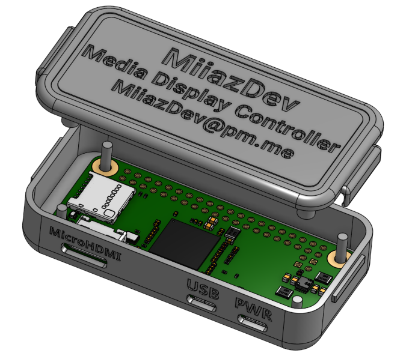
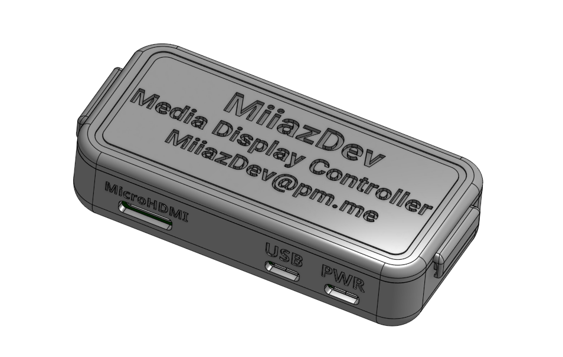

# Media Display Controller
A lightweight Raspberry Pi based (RPI Zero 2W) Media Display Controller made to download promotional materials from Youtube and automatically loop them 

## Included Scripts
- `.bash_profile`: Launches `mpv` in fullscreen loop mode on physical terminal (TTY1).
- `scripts/update_videos.sh`: Updates video playlist from `yt_urls.txt` located on device.
- `scripts/usb_update.sh`: Updates video playlist from `yt_urls.txt` found on a USB drive.

## Requirements
- `yt-dlp`
- `mpv`

## Usage
1. Add your YouTube links to `yt_urls.txt`
2. Run `bash update_videos.sh` manually or plug in a USB with the file to trigger `usb_update.sh` (If auto detection is still flaky run `usb_update.sh` 
3. System autoplays updated videos on boot

## Example Housing: 

  
   
  

Onshape: https://cad.onshape.com/documents/b498f7b0428b1469fbb3d5d3/w/35c5318d5d70c1912058a1ed/e/d3772819c88d160de8fc96f1
